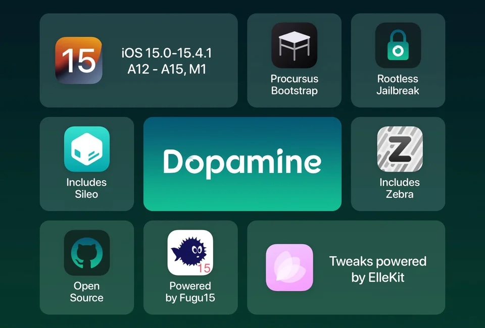
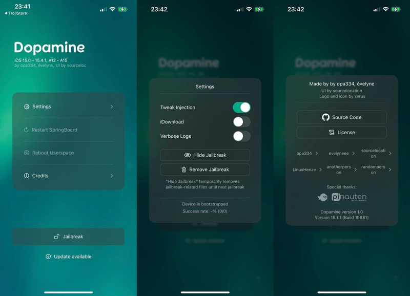

# Dopamine

* Dopamine
  * 概述
    * iOS15的rootless越狱工具
      * a semi-untethered permasigned jailbreak for iOS 15
  * 越狱类型：`rootless jailbreak`
  * Logo
    * 
  * 名称
    * 旧称：`Fugu15 Max`
      * `Fugu15`的作者：`Linus Henze`
  * 作者：`opa334` == `Lars Fröder`
    * Twitter：https://twitter.com/opa334dev
  * 资料
    * 官网
      * Dopamine Jailbreak (ellekit.space)
        * https://ellekit.space/dopamine/
    * Github
      * opa334/Dopamine: Dopamine is a semi-untethered permasigned jailbreak for iOS 15 (github.com)
        * https://github.com/opa334/Dopamine
  * 支持：
    * iOS/iPadOS版本：`15.0-15.4.1`
    * 芯片=CPU：
      * 具体型号：`A12+` == `A12`~`A15`、M1
      * 对应的架构：`arm64e`
      * 对应的机型：iPhone XS, iPhone XS Max,iPhone XR, iPhone 11 Pro, iPhone 11 Pro Max, iPhone 11, iPhone 12 Pro, iPhone 12 Pro Max, iPhone 12, iPhone 12 mini, iPhone 13 Pro, iPhone 13 Pro Max, iPhone 13 mini, and iPhone 13
  * 基于：`Fugu15`
    * Fugu15
      * 功能=特点=机制
        * Automatic trust cache handling
        * 插件注入框架：`ElleKit`
          * `tweak injection framework`=`插件注入框架`
          * =`tweak injection method`=`插件注入方法`
          * =`tweak hook library`=`插件hook库`
        * `libkrw` (including the ability to write to PPL protected memory and kcalling primitives)
      * 特殊：有个WiFi的bug
        * 说明：Dopamine已经修复此WiFi的bug了
  * 包管理器
    * 默认：`Sileo`、`Zebra`
      * 当然可自行切换为别的，比如`Saily`
  * 图
    * 
    * 
  * 其他
    * 越狱期间，需要临时关闭WiFi（越狱后，可正常开启Wifi）
    * 默认已加了rootless的软件源：Chariz、Havoc、Ellekit.space、Procurus、zp、BigBoss

 