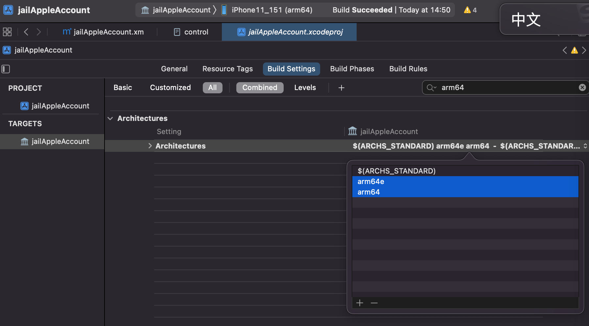

# iPhone机型信息

越狱之前，需要搞清楚，常见的iPhone设备的信息，尤其是arm的架构，尤其是最新的`A12+`芯片所支持的`ARMv8.3`的`arm64e`。

因为后续比如`palera1n`等越狱时，会涉及到。要先搞清楚：

* ARM Architecture: `arm64e`
  * iPhone 13 / iPhone 13 Pro
    * SoC: `A15`
  * iPhone 12 / iPhone 12 Pro
    * SoC: `A14`
  * iPhone 11 / iPhone 11 Pro / iPhone SE (2nd generation)
    * SoC: `A13`
  * iPhone XS / iPhone XR
    * SoC: `A12`
* ARM Architecture: `arm64`
  * iPhone X / iPhone 8
    * SoC: `A11`
  * iPhone 7
    * SoC: `A10`
  * iPhone 6s / iPhone SE (1st generation)
    * SoC: `A9`
  * iPhone 6
    * SoC: `A8`
  * iPhone 5s
    * SoC: `A7`
* ARM Architecture: `armv7s`
  * iPhone 5c / iPhone 5
    * SoC: `A6`
* ARM Architecture: `armv7`
  * iPhone 4S
    * SoC: `A5`
  * iPhone 4
    * SoC: `A4`
* ARM Architecture: `armv6`
  * iPhone 3GS
    * SoC: `APL0298`
  * iPhone 2G
    * SoC: `APL0098`


## 搞懂iPhone机型信息有何用？

这样才能在iOS逆向期间，对于涉及到ARM架构的时候，有所了解底层的含义：

比如：

### iOS 13的AppleIDAuthSupport库所支持的iPhone机型

不同机型所对应的ARM的架构是：

* armv6
* armv7
* armv7s
* arm64
* arm64e

而iOS的很多的Framework库，本身支持足够多的iOS的机型，所以会看到：

iOS的Framework库的`tbd`信息中，包括了支持的多个的`ARM`的`arch`架构

比如：

* [iOS 13的AppleIDAuthSupport.tbd](https://github.com/xybp888/iOS-SDKs/blob/master/iPhoneOS13.0.sdk/System/Library/PrivateFrameworks/AppleIDAuthSupport.framework/AppleIDAuthSupport.tbd)
  * iPhoneOS13.0.sdk/System/Library/PrivateFrameworks/AppleIDAuthSupport.framework/AppleIDAuthSupport.tbd
    ```asm
    ....
    archs:                 [ armv7, armv7s, arm64, arm64e ]
    platform:              ios
    ...
    install-name:          /System/Library/PrivateFrameworks/AppleIDAuthSupport.framework/AppleIDAuthSupport
    ```
    * iOS 13.0的AppleIDAuthSupport.framework库，支持多个ARM的arch架构：armv7, armv7s, arm64, arm64e
      * 意思就是，这个库，支持如下机型的iPhone
          * armv7 的 `iPhone 4/4S`
          * armv7s 的 `iPhone 5/5c`
          * arm64 的 `iPhone 5s/6/6s/SE(1st generation)/7/8/X`
          * arm64e 的 `iPhone XS / XR / 11/11 Pro/SE (2nd generation)/12/12 Pro/13/ 13 Pro`

### arm64和arm64e的区别

才能搞懂，arm64和arm64e的区别：

#### XinaA15中的libsubstrate.dylib的不同版本

* `XinaA15`越狱后的`A12`的`iPhone11`
  * 有2个`libsubstrate.dylib`
    * `/private/preboot/3B92D6F7C3FE6444A715B312E418498574E442DAB2F6D9E18B58B762F71D1455B7E2E1C2DD3912B1B4E6D10C6B9150C8/procursus/xina/libsubstrate.dylib`
      * 大小：`51KB`
      * 只支持一种架构：`arm64e`
    * `/private/preboot/3B92D6F7C3FE6444A715B312E418498574E442DAB2F6D9E18B58B762F71D1455B7E2E1C2DD3912B1B4E6D10C6B9150C8/procursus/usr/lib/libsubstrate.dylib`
      * 大小：`218KB`
      * 支持2种架构：`arm64`和`arm64e`

#### Xcode编译插件时如何支持A12芯片的iPhone11

才能明白，Xcode编译插件，去调试时：

* 报错

```bash
默认    14:50:37.206463+0800    Preferences    正在修复 path=/private/preboot/3B92D6F7C3FE6444A715B312E418498574E442DAB2F6D9E18B58B762F71D1455B7E2E1C2DD3912B1B4E6D10C6B9150C8/procursus/Library/MobileSubstrate/DynamicLibraries/jailAppleAccount.dylib
默认    14:50:37.206568+0800    jailbreakd    /private/preboot/3B92D6F7C3FE6444A715B312E418498574E442DAB2F6D9E18B58B762F71D1455B7E2E1C2DD3912B1B4E6D10C6B9150C8/procursus/Library/MobileSubstrate/DynamicLibraries/jailAppleAccount.dylib
默认    14:50:37.207165+0800    Preferences    tweakinject 注入失败原因:dlopen(/var/Liy/Library/MobileSubstrate/DynamicLibraries/jailAppleAccount.dylib, 0x0009): tried: '/var/Liy/Library/MobileSubstrate/DynamicLibraries/jailAppleAccount.dylib' (mach-o file, but is an incompatible architecture (have 'arm64', need 'arm64e')), '/usr/local/lib/jailAppleAccount.dylib' (no such file), '/usr/lib/jailAppleAccount.dylib' (no such file), '/private/preboot/3B92D6F7C3FE6444A715B312E418498574E442DAB2F6D9E18B58B762F71D1455B7E2E1C2DD3912B1B4E6D10C6B9150C8/procursus/Library/MobileSubstrate/DynamicLibraries/jailAppleAccount.dylib' (mach-o file, but is an incompatible architecture (have 'arm64', need 'arm64e')), '/usr/local/lib/jailAppleAccount.dylib' (no such file), '/usr/lib/jailAppleAccount.dylib' (no such file), '/private/preboot/3B92D6F7C3FE6444A715B312E418498574E442DAB2F6D9E18B58B762F71D1455B7E2E1C2DD3912B1B4E6D10C6B9150C8/procursus/Library/MobileSubstrate/DynamicLibraries/jailAppleAccount.dylib' (mach-o file, but is an incompatible architecture (have <…>
```

* 原因

是当前Xcode中的ARM的架构

* `Xcode`->`TARGETS`->`YourProjectName`->`Build Settings`->`Architectures`->`Architectures`
  * 默认值是：`arm64`, `armv7`
    * 所以才：不支持`arm64e`的`A12`芯片的`iPhone11`

* 解决办法

而想要让其支持`arm64e`的`A12`芯片的`iPhone11`，则去改为：`arm64 arm64e`，即可


