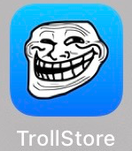

# TrollStore

* `TrollStore`
  * 中文名：`巨魔`=`巨魔商店`
  * 作用：永久签名工具
    * 让你可以直接安装各种ipa文件
      * 它可以在不越狱的条件随意安装IPA，且不依赖证书就能做到“永久签名”
    * 内部逻辑：绕过iOS系统的限制
      * 普通ipa，签名无法通过校验，无法安装
        * 或者是用自己的AppleID签名，但是过了默认的7天限制，需要重新签名-》很麻烦
    * 效果：使用TrollStore我们可以随便签名各种修改版的IPA、应用多开等等
      * 只要系统满足安装要求，那就不用再依赖证书，安装的IPA“永久有效”
  * 作者：`opa334`
  * logo图标
    * 
  * 官网
    * 官方的github
      * opa334/TrollStore: Jailed iOS app that can install IPAs permanently with arbitary entitlements and root helpers because it trolls Apple (github.com)
        * https://github.com/opa334/TrollStore
    * 疑似的官网
      * TrollStore - Permanently Sideload Any IPAs For Free
        * https://trollstore.app
  * 安装
    * 概述：多种安装方式
      * 通过iPhone中的Safari浏览器安装
      * 通过ipa安装
      * 等等
    * 文档
      * https://github.com/opa334/TrollStore 中的：`Installation Guides`
        * 比如适用于此处`iOS 15.1`的`iPhone 11`的
          * [TrollStore/install_trollhelperota_ios15.md at main · opa334/TrollStore · GitHub](https://github.com/opa334/TrollStore/blob/main/install_trollhelperota_ios15.md)
