# iPhone中安装TrollStore

* 有多种安装方式
  * 通过`浏览器`安装TrollStore
    * iPhone中，用Safari打开链接：https://api.jailbreaks.app/troll
    * 具体步骤详见
      * [TrollStore/install_trollhelperota_ios15.md at main · opa334/TrollStore · GitHub](https://github.com/opa334/TrollStore/blob/main/install_trollhelperota_ios15.md)
  * 用`Sideloadly`安装TrollStore
    * 对应安装包：`TrollStore Installer IPA`=`TrollInstaller.ipa`
      * 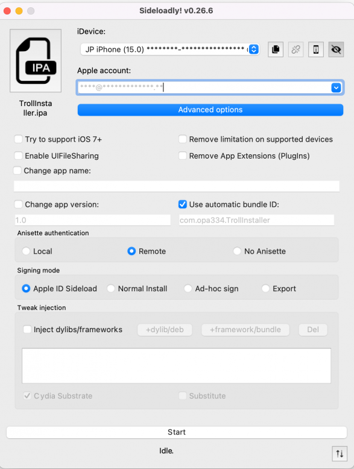

此处最后的选择是：

* 没用：Sideloadly去安装TrollStore的ipa
  * 因为TrollStore的ipa是旧版本，而另外缺找不到最新版本的TrollStore的ipa
    * 估计是：安装了旧版本TrollStore后，也可以通过OTA升级到最新版，但是懒得去弄
* 改用：参考官网[github文档](https://github.com/opa334/TrollStore/blob/main/install_trollhelperota_ios15.md)，去用Safari浏览器去安装TrollStore

## iPhone11中用Safari浏览器去安装TrollStore

### 核心步骤

iPhone->Safari浏览器-》打开地址 https://api.jailbreaks.app/troll -》 “在iTunes中打开此页” 的弹框中：打开 -》“jailbreak.app想要安装TrollHelper”的弹框中：安装 -》桌面出现app图标JB，显示：正在安装 ->桌面上新增app：GTA Car Tracker -》点击进入GTA Car Tracker-》app标题是TrollStore Helper -》点击Install TrollStore-》稍等一会，iPhone重启-》桌面上出现：TrollStore

### 详细解释

* iPhone->Safari浏览器-》打开地址 https://api.jailbreaks.app/troll
  * 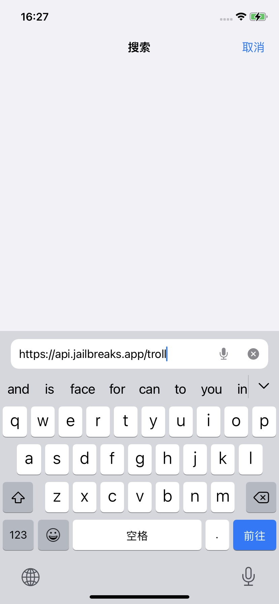
* -》 “在iTunes中打开此页”？弹框中：打开
  * 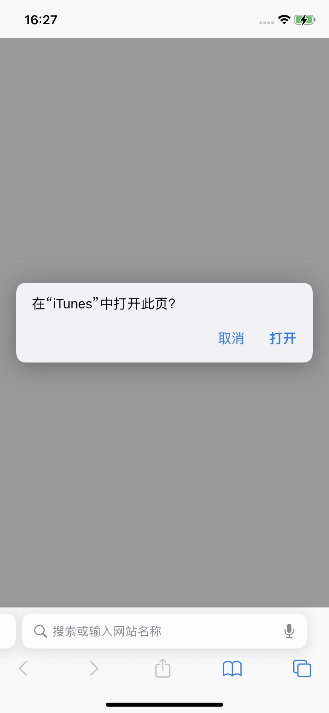
* -》“jailbreak.app想要安装TrollHelper”的弹框中：安装
  * 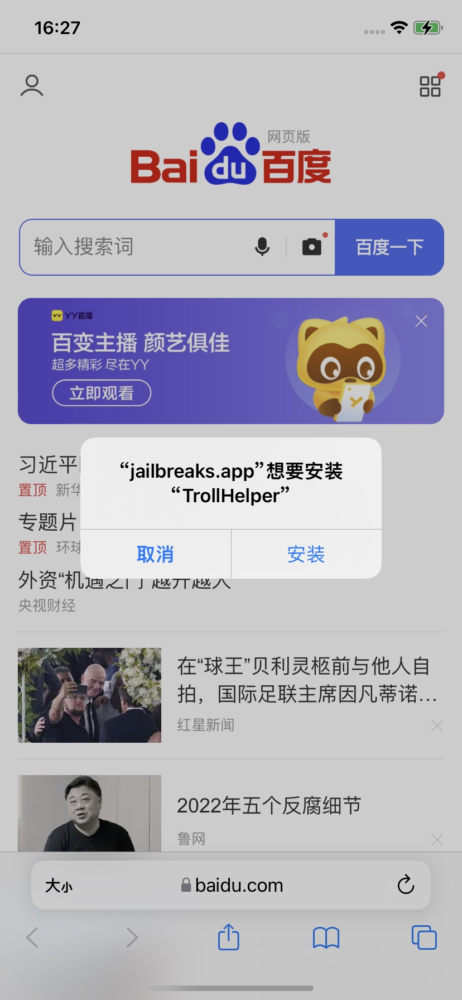
* -》桌面出现app图标JB，显示：正在安装
  * 
* ->桌面上新增app：GTA Car Tracker
  * 
* -》点击进入GTA Car Tracker-》app标题是TrollStore Helper
  * 
* -》点击Install TrollStore-》稍等一会，iPhone重启-》桌面上出现：TrollStore
  * 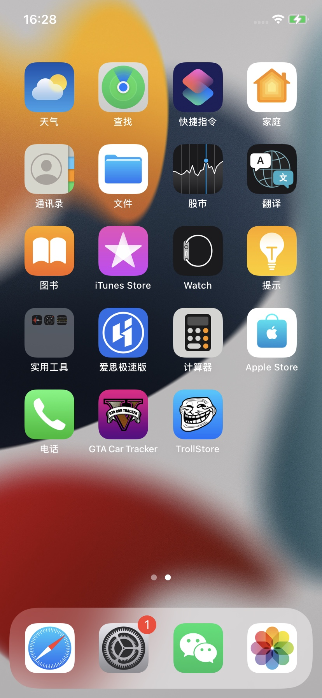

## 安装TrollStore后

### 把TrollStore设置为持续存在

在iPhone中安装了TrollStore后，为了使后续系统图标刷新等操作，不会导致TrollStore无法正常使用，比如变成User用户模式或打不开

所以需要去：

* 把TrollStore设置为持续存在`Persistence`
  * 核心思路：找个（自己平时不用的）系统app 或 （比如此处）就用上面的`GTA Car Tracker`，去设置为`Persistence Helper`
  * 具体步骤：点击`GTA Car Tracker`
    * -》`Register Persistence Helper`
      * 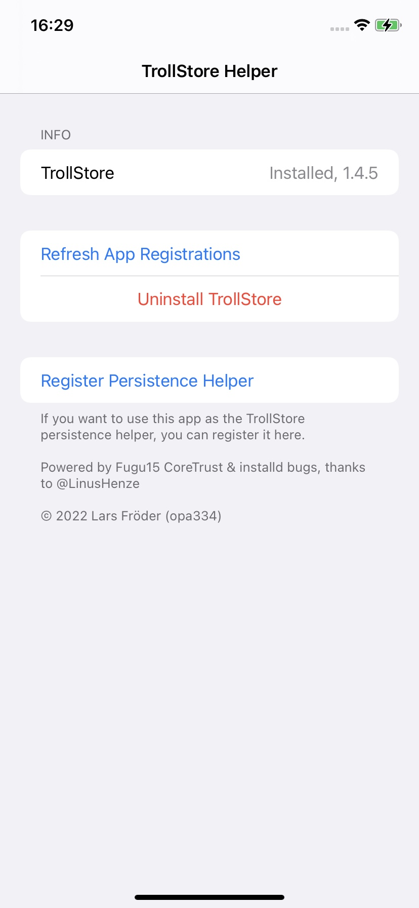
    * 注册后的效果是
      * 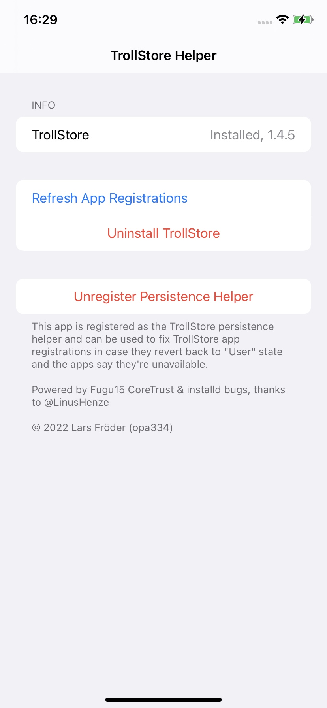
  * 详细过程参考官网文档：
    * [TrollStore/install_trollhelperota_ios15.md at main · opa334/TrollStore · GitHub](https://github.com/opa334/TrollStore/blob/main/install_trollhelperota_ios15.md)
  * 注意：
    * 后续不能删除`TrollStore Helper`==此处的`GTA Car Tracker`
      * 因为：上面通过GTA Car Tracker == TrollStore Helper，点击了其中的：Register Persistence Helper，意思是把GTA Car Tracker作为了一个系统的app，用于后续TrollStore的永久保持的功能，所以以后不能删除此app：GTA Car Tracker

### 初始化配置TrollStore

安装完毕TrollStore后，还需要：

* 初始化配置TrollStore
  * 核心步骤：TrollStore -> Settings -> Install ldid
  * 详细步骤
    * TrollStore-> Settings -> Install ldid
      * 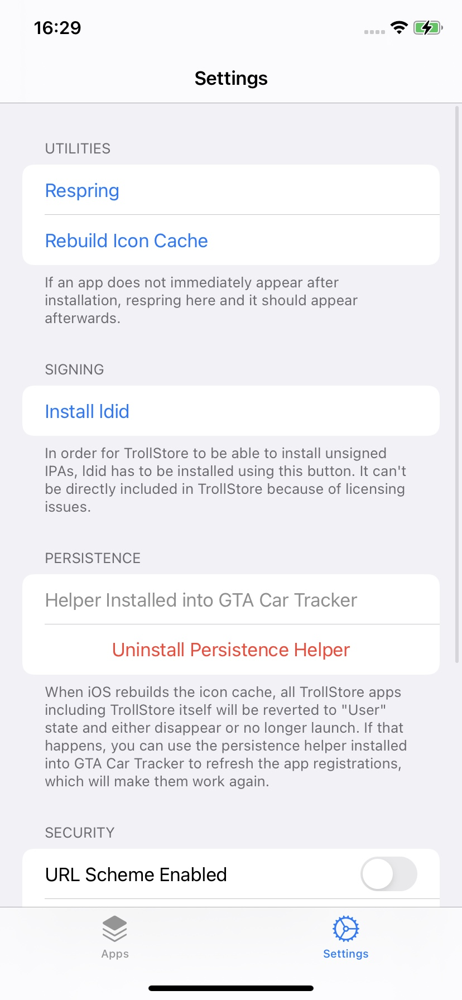
    * 显示正在安装：`Installing ldid`
      * 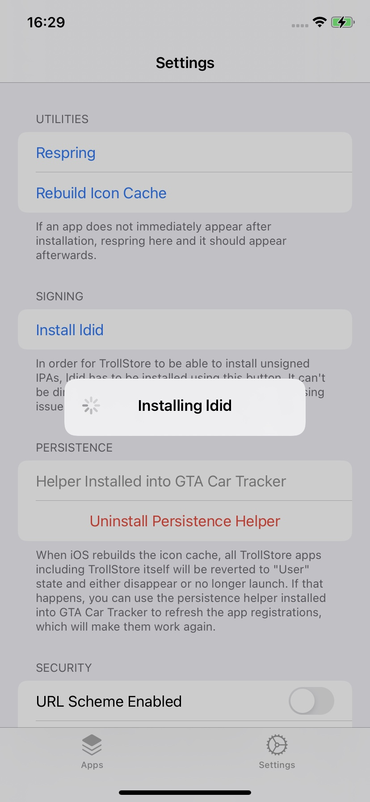
    * ldid安装完毕后
      * 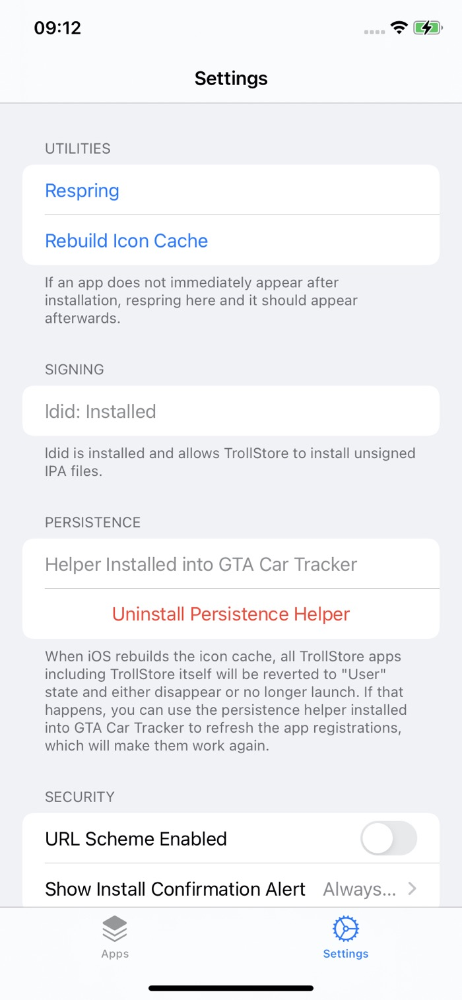
        * 会看到文字提示：`ldid is installed and allows TrollStore to install unsigned IPA files`

#### 常见错误

##### Error downloading ldid Code 1001 请求超时

如果`installing ldid`期间：

* 报错：Error downloading ldid Code 1001 请求超时
  * 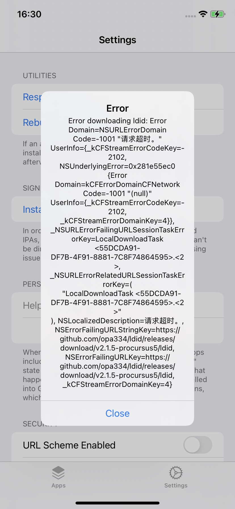
* 原因：无法访问外网（https://github.com/xxx）
* 解决办法：用Shadowrocket小火箭，加上代理，确保翻墙后可以正常上外网
  * 详见
    * 【已解决】给iOS 15.1的iPhone 11去翻墙科学上网安装代理

### 升级TrollStore

* 升级TrollStore
  * TrollStore中如果有新版本，则会有对应新版本提示
    * 此处的：Update TrollStore to 1.5.0
      * 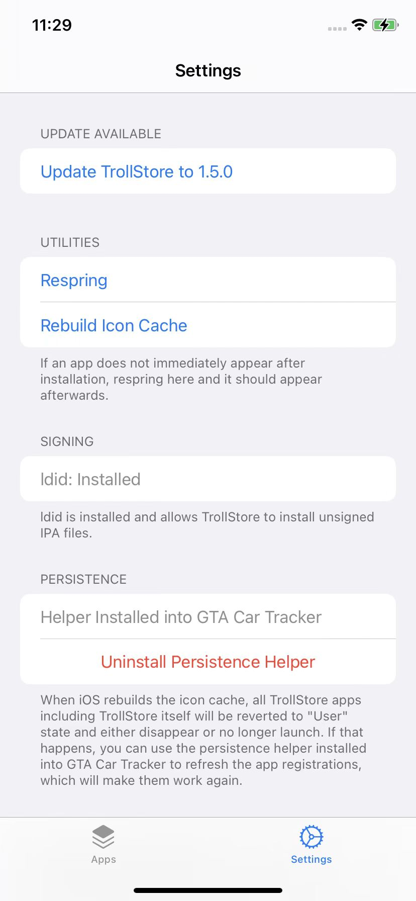
    * 点击继续安装即可
      * 注：同理，确保能上外网，否则会出现下载失败的情况
    * 更新后：1.5.0
      * 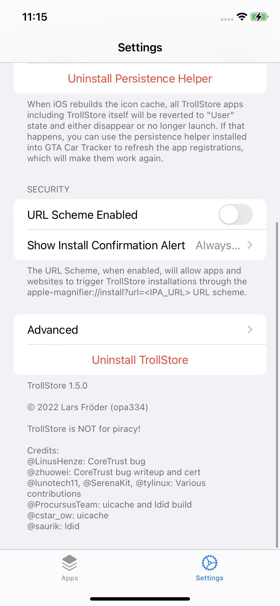
