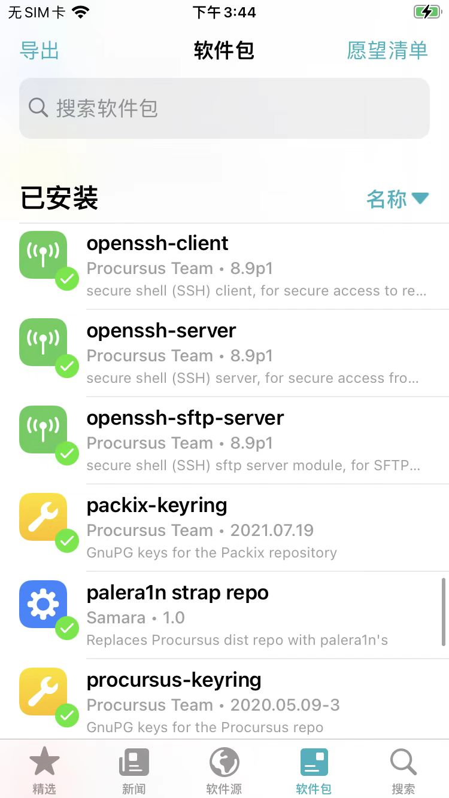

# ssh可以直接使用

因为已自动安装了对应OpenSSH的相关插件：

* openssh-client
* openssh-server
* openssh-sftp-server



## 初始化ssh环境

第一次连接：

```bash
ssh root@192.168.2.13
```

* 说明
  * `192.168.2.13`：你的iPhone的IP
    * 和你的Mac使用同一个WiFi(网络)

输入：`yes`

再输入（OpenSSH的默认）密码：`alpine`

## ssh免密登录

```bash
ssh-copy-id root@192.168.2.13
```

输入密码，即可：

-》之后每次直接连接：

```bash
ssh root@192.168.2.13
```

而无需密码。

---

TODO：加上palera1n的rootless越狱后，ssh无法直接使用的过程。
