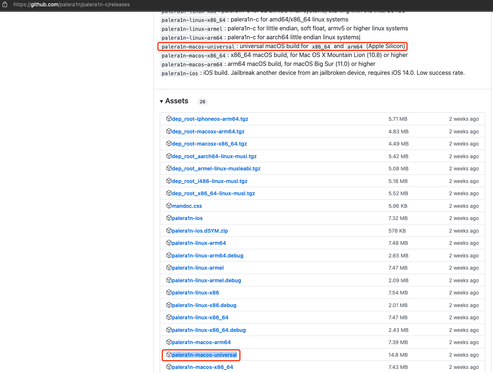
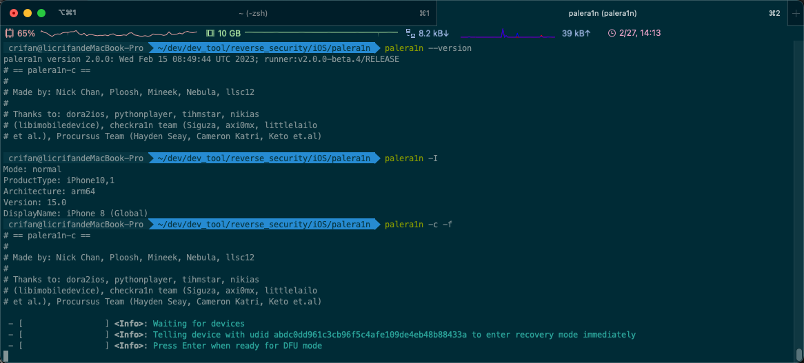
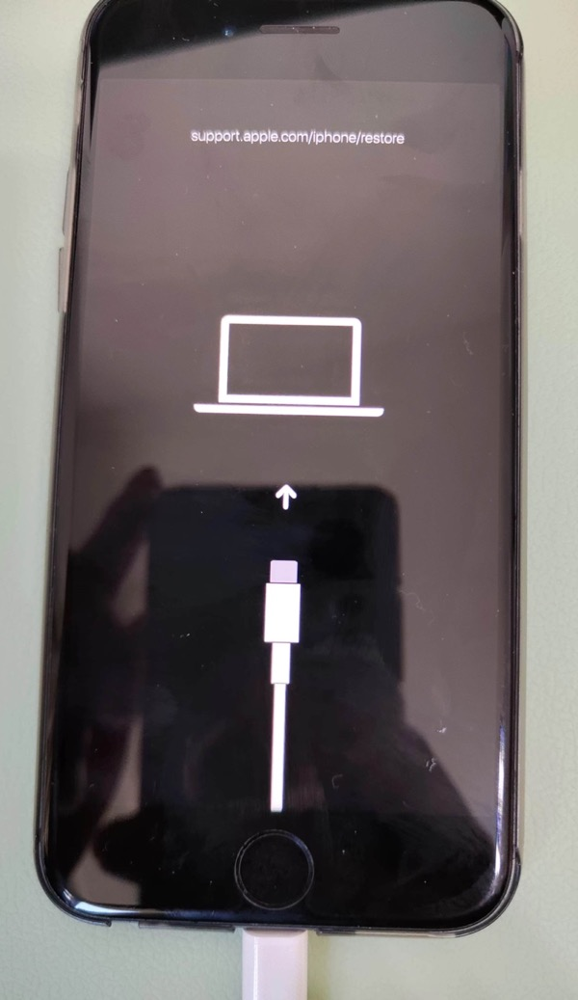
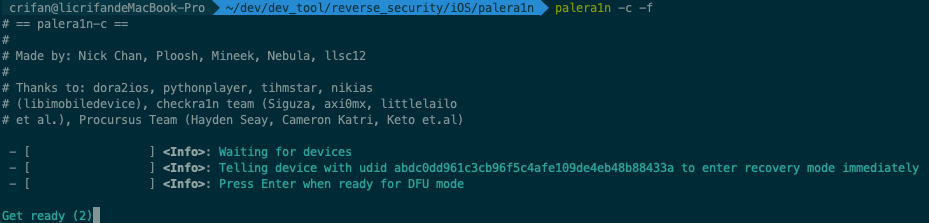
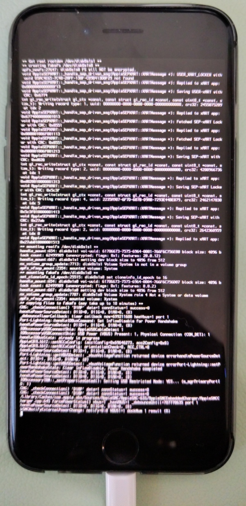
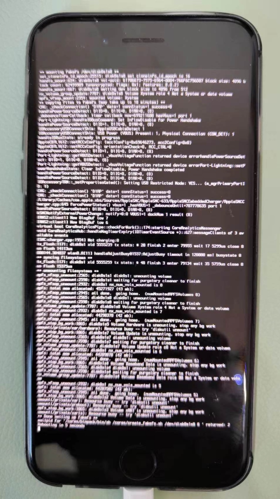
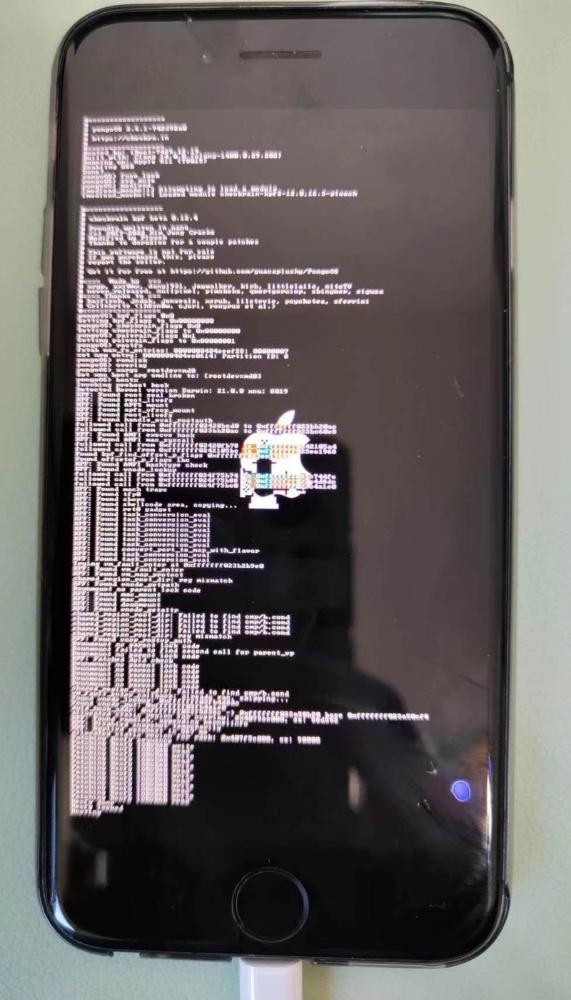
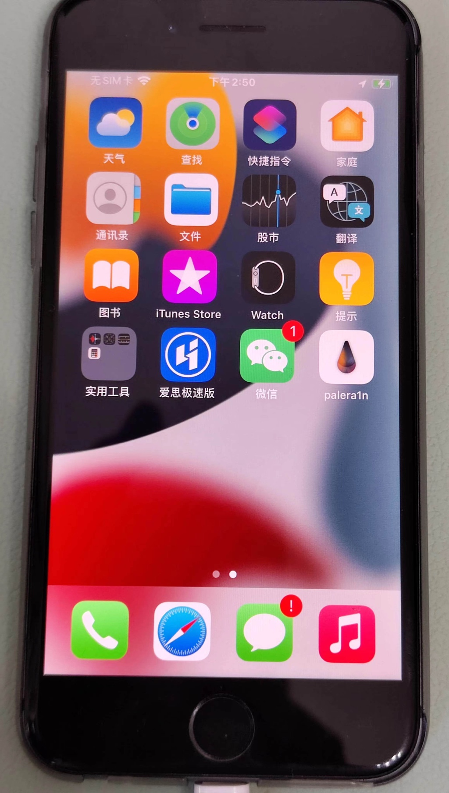
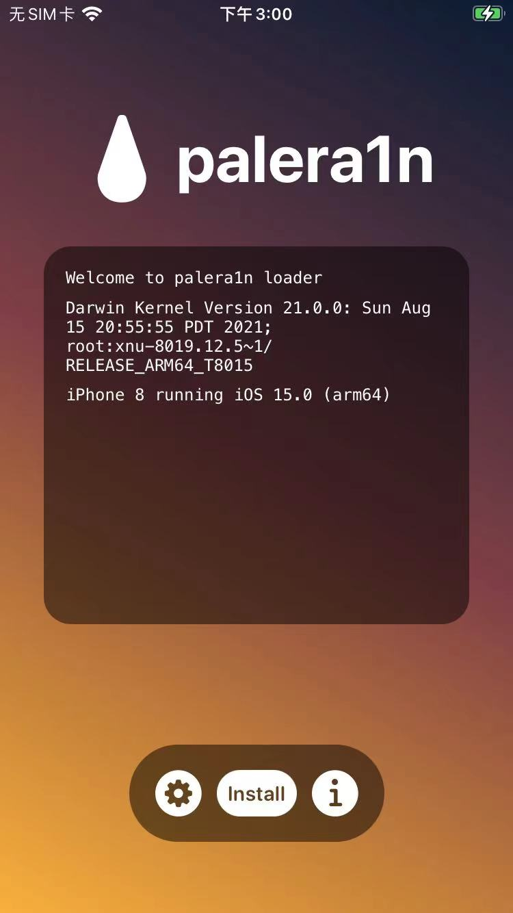

# 用palera1n给iOS 15.0的iPhone8越狱的详细过程

## 第一步：下载palera1n的二进制

此处下载：Mac的palera1n的二进制文件：

palera1n-macos-universal

https://github.com/palera1n/palera1n-c/releases/download/v2.0.0-beta.4/palera1n-macos-universal



并放到合适的目录中，比如：

`/usr/local/bin/palera1n`

此过程：

* 可以手动操作
* 也可以用命令去操作

```bash
sudo curl -Lo /usr/local/bin/palera1n https://github.com/palera1n/palera1n-c/releases/download/v2.0.0-beta.4/palera1n-macos-universal
sudo chmod +x /usr/local/bin/palera1n
```

或：

```bash
sudo mv ./palera1n-macos-universal /usr/local/bin/
mv /usr/local/bin/palera1n-macos-universal /usr/local/bin/palera1n
sudo xattr -c /usr/local/bin/palera1n
sudo chmod +x /usr/local/bin/palera1n
```

放好后，确保命令行可以找到：

```bash
> which palera1n
/usr/local/bin/palera1n
```

另外顺带去看看版本：

```bash
crifan@licrifandeMacBook-Pro  ~/dev/dev_tool/reverse_security/iOS/palera1n  palera1n --version
palera1n version 2.0.0: Wed Feb 15 08:49:44 UTC 2023; runner:v2.0.0-beta.4/RELEASE
# == palera1n-c ==
#
# Made by: Nick Chan, Ploosh, Mineek, Nebula, llsc12
#
# Thanks to: dora2ios, pythonplayer, tihmstar, nikias
# (libimobiledevice), checkra1n team (Siguza, axi0mx, littlelailo
# et al.), Procursus Team (Hayden Seay, Cameron Katri, Keto et.al)
```

## 第二步：palera1n -c -f，安装创建fakefs

然后就可以开始用palera1n去越狱了：

```bash
palera1n -c -f
```

其中：

* `-c`, `--setup-fakefs`       Setup fakefs
  * When used with -f, --fakefs, Create the new APFS volume required for rootful. Will fail if one already exists.
    * 创建fakefs
* `-f`, `--fakefs`              Boots fakefs
  * Jailbreak in rootful mode.
    * 越狱方式/类型/模式选择：普通越狱=rootful越狱

详细log日志：

```bash
crifan@licrifandeMacBook-Pro  ~/dev/dev_tool/reverse_security/iOS/palera1n  palera1n -c -f
# == palera1n-c ==
#
# Made by: Nick Chan, Ploosh, Mineek, Nebula, llsc12
#
# Thanks to: dora2ios, pythonplayer, tihmstar, nikias
# (libimobiledevice), checkra1n team (Siguza, axi0mx, littlelailo
# et al.), Procursus Team (Hayden Seay, Cameron Katri, Keto et.al)

 - [02/27/23 14:13:08] <Info>: Waiting for devices
 - [02/27/23 14:13:08] <Info>: Telling device with udid abdc0dd961c3cb96f5c4afe109de4eb48b88433a to enter recovery mode immediately
 - [02/27/23 14:13:20] <Info>: Press Enter when ready for DFU mode
```



此时：iPhone手机中出现：

* 数据线插入电脑
  * 顶部文字：`support.apple.com/iphone/restore`

的界面：



然后去：

* Enter=回车

确认准备好，提示：`get ready`



再根据提示：

```bash
Get ready (0)
Hold volume down + side button (0)
Hold volume down button (3)
```

* 去操作iPhone进入DFU模式
  * Hold volume down + side button 长按 音量键减键 + 侧边栏键=电源键
  * Hold volume down button （保持不松手，继续）长按 音量键减键

即可继续，进入DFU模式，继续自动越狱过程

详细log日志：

```bash
- [02/27/23 14:37:54] <Info>: Device entered DFU mode successfully
 - [02/27/23 14:37:54] <Info>: About to execute checkra1n
#
# Checkra1n 0.1337.1
#
# Proudly written in nano
# (c) 2019-2023 Kim Jong Cracks
#
#========  Made by  =======
# argp, axi0mx, danyl931, jaywalker, kirb, littlelailo, nitoTV
# never_released, nullpixel, pimskeks, qwertyoruiop, sbingner, siguza
#======== Thanks to =======
# haifisch, jndok, jonseals, xerub, lilstevie, psychotea, sferrini
# Cellebrite (ih8sn0w, cjori, ronyrus et al.)
#==========================

 - [02/27/23 14:37:54] <Verbose>: Starting thread for Apple TV 4K Advanced board
 - [02/27/23 14:37:54] <Info>: Waiting for DFU mode devices
 - [02/27/23 14:37:54] <Verbose>: DFU mode device found
 - [02/27/23 14:37:54] <Info>: Checking if device is ready
 - [02/27/23 14:37:54] <Verbose>: Attempting to perform checkm8 on 8015 11
 - [02/27/23 14:37:54] <Info>: Setting up the exploit
 - [02/27/23 14:37:54] <Verbose>: == checkm8 setup stage ==
 - [02/27/23 14:37:54] <Verbose>: Entered initial checkm8 state after 1 steps
 - [02/27/23 14:37:54] <Verbose>: Stalled input endpoint after 4 steps
 - [02/27/23 14:37:54] <Verbose>: DFU mode device disconnected
 - [02/27/23 14:37:54] <Verbose>: DFU mode device found
 - [02/27/23 14:37:54] <Verbose>: == checkm8 trigger stage ==
 - [02/27/23 14:37:57] <Info>: Checkmate!
 - [02/27/23 14:37:57] <Verbose>: Device should now reconnect in download mode
 - [02/27/23 14:37:57] <Verbose>: DFU mode device disconnected
 - [02/27/23 14:38:04] <Info>: Entered download mode
 - [02/27/23 14:38:04] <Verbose>: Download mode device found
 - [02/27/23 14:38:04] <Info>: Booting PongoOS...
 - [02/27/23 14:38:06] <Info>: Found PongoOS USB Device
 - [02/27/23 14:38:06] <Info>: Booting Kernel...
 crifan@licrifandeMacBook-Pro  ~/dev/dev_tool/reverse_security/iOS/palera1n 
```

然后手机上会输出很多log日志：



直到看到最后的log：`rebooting in 5 seconds`



iPhone会继续重启，然后进入桌面

此时iPhone桌面中，还没有安装palera1n的app。

## 第三步：palera1n  -f，首次会安装palera1n的app

继续去：

```bash
palera1n -f
```

去：启动设备

继续按照提示，操作iPhone进入DFU模式

详细log日志：

```bash
crifan@licrifandeMacBook-Pro  ~/dev/dev_tool/reverse_security/iOS/palera1n  palera1n -f
# == palera1n-c ==
#
# Made by: Nick Chan, Ploosh, Mineek, Nebula, llsc12
#
# Thanks to: dora2ios, pythonplayer, tihmstar, nikias
# (libimobiledevice), checkra1n team (Siguza, axi0mx, littlelailo
# et al.), Procursus Team (Hayden Seay, Cameron Katri, Keto et.al)

 - [02/27/23 14:48:09] <Info>: Waiting for devices
 - [02/27/23 14:48:09] <Info>: Telling device with udid abdc0dd961c3cb96f5c4afe109de4eb48b88433a to enter recovery mode immediately
 - [02/27/23 14:48:20] <Info>: Press Enter when ready for DFU mode

Get ready (0)
Hold volume down + side button (0)
Hold volume down button (5)
 - [02/27/23 14:49:55] <Info>: Device entered DFU mode successfully
 - [02/27/23 14:49:56] <Info>: About to execute checkra1n
#
# Checkra1n 0.1337.1
#
# Proudly written in nano
# (c) 2019-2023 Kim Jong Cracks
#
#========  Made by  =======
# argp, axi0mx, danyl931, jaywalker, kirb, littlelailo, nitoTV
# never_released, nullpixel, pimskeks, qwertyoruiop, sbingner, siguza
#======== Thanks to =======
# haifisch, jndok, jonseals, xerub, lilstevie, psychotea, sferrini
# Cellebrite (ih8sn0w, cjori, ronyrus et al.)
#==========================

 - [02/27/23 14:49:56] <Verbose>: Starting thread for Apple TV 4K Advanced board
 - [02/27/23 14:49:56] <Info>: Waiting for DFU mode devices
 - [02/27/23 14:49:56] <Verbose>: DFU mode device found
 - [02/27/23 14:49:56] <Info>: Checking if device is ready
 - [02/27/23 14:49:56] <Verbose>: Attempting to perform checkm8 on 8015 11
 - [02/27/23 14:49:56] <Info>: Setting up the exploit
 - [02/27/23 14:49:56] <Verbose>: == checkm8 setup stage ==
 - [02/27/23 14:49:56] <Verbose>: Entered initial checkm8 state after 1 steps
 - [02/27/23 14:49:56] <Verbose>: Stalled input endpoint after 6 steps
 - [02/27/23 14:49:56] <Verbose>: DFU mode device disconnected
 - [02/27/23 14:49:56] <Verbose>: DFU mode device found
 - [02/27/23 14:49:56] <Verbose>: == checkm8 trigger stage ==
 - [02/27/23 14:49:57] <Info>: Checkmate!
 - [02/27/23 14:49:57] <Verbose>: Device should now reconnect in download mode
 - [02/27/23 14:49:57] <Verbose>: DFU mode device disconnected
 - [02/27/23 14:50:04] <Info>: Entered download mode
 - [02/27/23 14:50:04] <Verbose>: Download mode device found
 - [02/27/23 14:50:04] <Info>: Booting PongoOS...
 - [02/27/23 14:50:06] <Info>: Found PongoOS USB Device
 - [02/27/23 14:50:06] <Info>: Booting Kernel...
```

iPhone中启动输出日志，其中屏幕中间可见 苹果的logo图标（其中嵌入了一个checkra1n的灯塔图标？）：



期间会自动安装：palera1n的app

进入iPhone桌面后，可以看到：

`palera1n的app` = `palera1n loader` = paleran的图标



## 第四步：进入palera1n的app去Install安装

打开palera1n的app后，进入主页，能看到有个Install按钮



此处会显示：

* 当前iPhone信息
  * iPhone 8 running i0s 15.0 (arm64)

点击Install，会继续越狱过程，输出log过程，直到最后：

* `Finished installing! Enjoy!`

期间会下载和安装：

* bootstrap.tar
* sileo.deb
* straprepo.deb

对应地址分别是：

* 此处的普通越狱
  * https://cdn.nickchan.lol/palera1n/loader/assets/bootstrap.tar
  * https://cdn.nickchan.lol/palera1n/loader/assets/sileo.deb
  * https://cdn.nickchan.lol/palera1n/loader/assets/straprepo.deb
* 如果是rootless越狱
  * https://cdn.nickchan.lol/palera1n/loader/assets/rootless/bootstrap.tar
  * https://cdn.nickchan.lol/palera1n/loader/assets/rootless/palera1nrepo.deb
  * https://cdn.nickchan.lol/palera1n/loader/assets/rootless/sileo.deb

点击：`Respring`=重启桌面

然后桌面上即可看到：`Sileo`了


至此，palera1n越狱过程就结束了。

可以愉快的用Sileo去安装各种越狱插件了。
