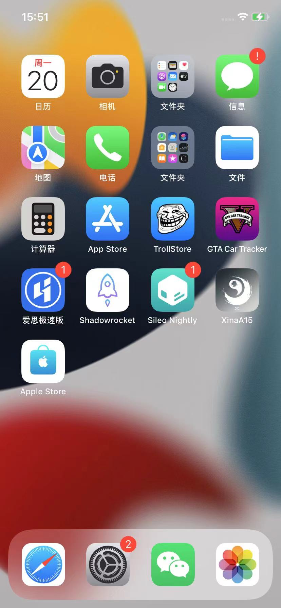
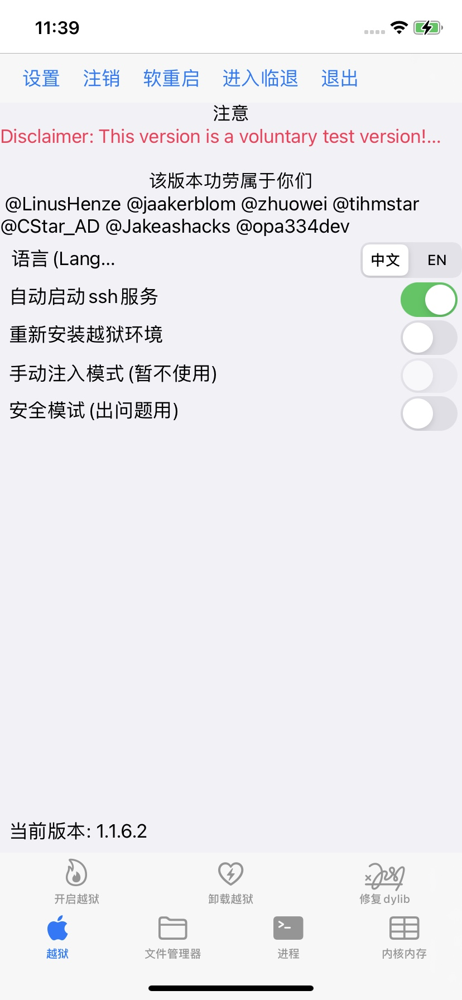
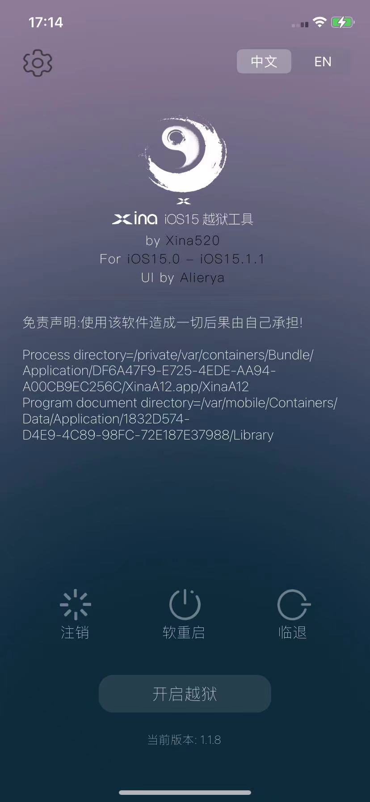
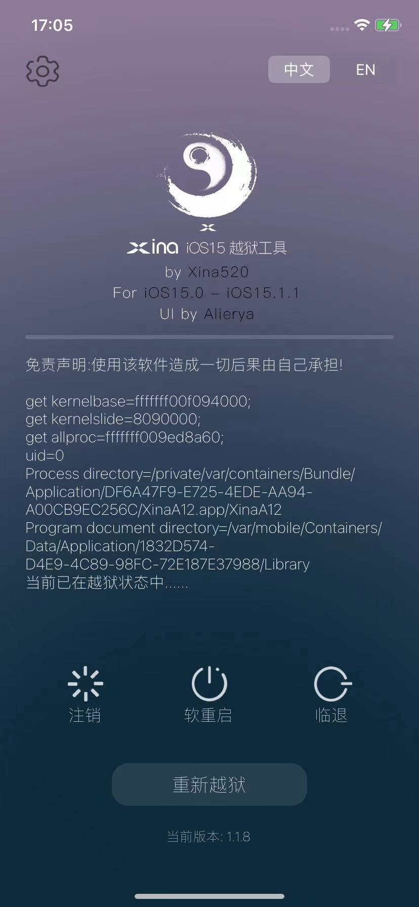
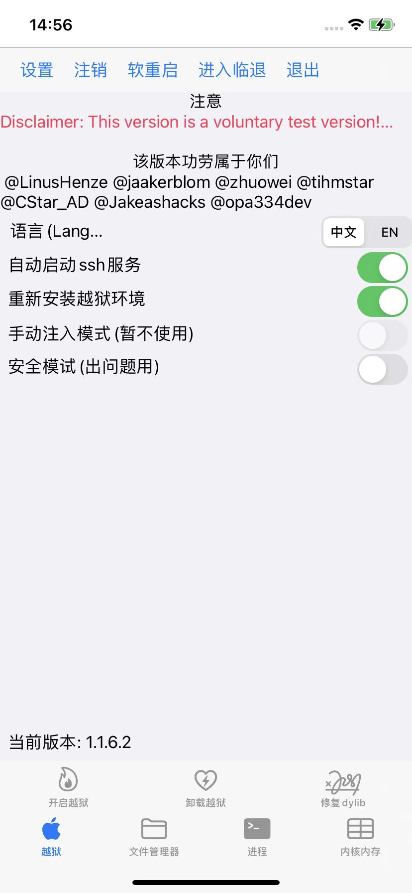
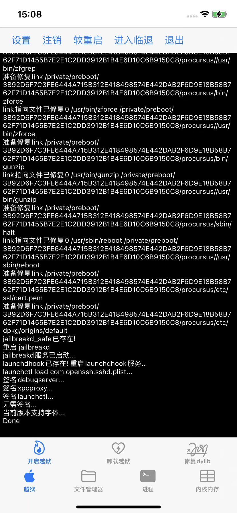
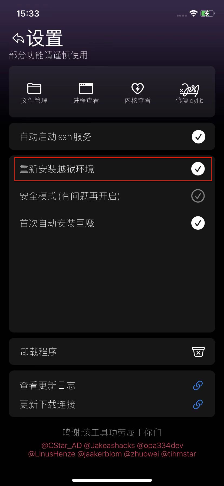
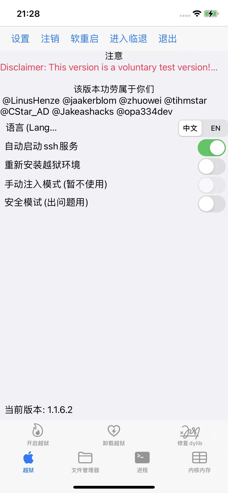
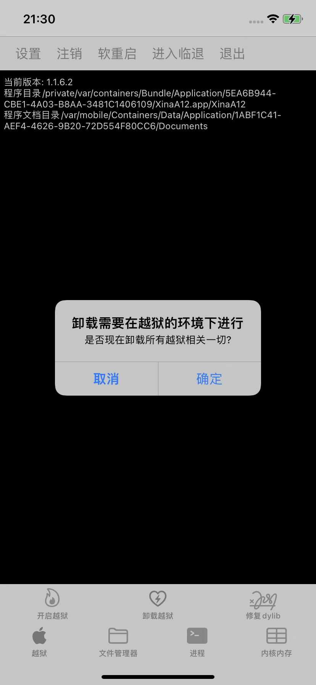

# XinaA15越狱后

## 基本信息

### 桌面图标和app

* XinaA15越狱后的，典型的桌面图标和app：
  * XinaA15
  * Sileo Nightly
  * TrollStore
  * GTA Car Tracker
* 图
  * 

### 越狱后iPhone信息

* 爱思助手查看iPhone的状态，可以显示：`已越狱`
  * 

## （XinaA15越狱后）如何使用

* （XinaA15越狱后）如何使用
  * 就是和普通的越狱iPhone一样去使用即可
    * 用ssh连接和操作iPhone
      * 其中已自带`OpenSSH`的`ssh`的server和client，可以直接使用ssh了（默认的ssh的用户名：`root`，密码：`alpine`）
    * 用包管理器`Sileo`安装各种插件
      * 注：此处是专门适配的特殊版本的`Sileo Nightly`
    * 用各种越狱插件工具`Logos`/`Theos`、`iOSOpenDev`、`MonkeyDev`等去开发越狱插件
    * `frida`：截至`20230406`，不可用
      * 可以安装frida，但是Mac中使用frida的命令（比如`frida-ps -U`）会导致iPhone重启，而无法正常使用
    * 等等

## 越狱后的功能和插件使用

### 详解XinaA15中如何使用ssh

* 详解XinaA15中如何使用ssh
  * 说明：XinaA15越狱后（的iOS 15.1的iPhone11中）默认已开启ssh服务
    * 配置中显示了：`自动启动ssh服务`
      * 
* 然后：直接用其他客户端去通过ssh连接iPhone即可
  * ssh（server）默认配置
    * 端口：`22`
    * 用户名：`root`
    * 密码： `alpine`
  * 客户端
    * 比如
      * Mac中默认的终端Terminal
  * 命令
    * `ssh root@192.168.2.12`
      * 其中：`192.168.2.12`是当前越狱iPhone的IP地址
  * 注：
    * 免密登录
      * `ssh-copy-id root@192.168.2.12`

### frida：不可用

* 关于frida：不可用
  * 现象：Mac中用`frida-ps -U`，就会导致iPhone重启
  * 当前版本
    * XinaA15 最新版 `1.1.8`
    * （iPhone11 + Mac中都是）Frida 最新版 `16.0.11`

## 其他越狱插件支持情况

* XinaA15是rootless越狱：之前很多插件会不可用，或者有问题
  * 网上有人整理了各种插件对于XinaA15的支持状态
    * 详见：【整理】XinaA15适配支持的越狱插件

## XinaA15本身的使用

### （重启而丢失越狱后如何）恢复越狱

* 恢复越狱
  * 现象
    * iPhone重启后，丢失越狱，具体现象：
      * XinaA15：没有显示 当前已在越狱状态中
        * 
      * 点击包管理器Sileo Nightly，会崩溃闪退而无法打开
      * ssh也无法使用
  * 核心步骤
    * 保持默认配置，直接点击 开启越狱 即可
      * 默认配置指的是：
        * 勾选了
          * 自动启动ssh服务
          * 首次自动安装巨魔
        * 没勾选
          * 重新安装越狱环境
          * 安全模式（有问题再开启）
      * 恢复越狱后
        * 显示：当前已在越狱状态中
          * 
    * 注意
      * 如果点击开启越狱后XinaA15崩溃，就多试几次

### 重新安装越狱

* 背景：有时候出现越狱问题，而无法解决时，可以考虑，重新越狱
* 重新安装越狱
  * 重新恢复最初的越狱环境：
    * 核心步骤：XinaA15-》勾选：重新安装越狱环境-》点击：开启越狱 -》iPhone无需（不会）重启，最后输出log是：Done，即表明恢复越狱成功
    * 详细步骤：
      * XinaA15-》勾选：重新安装越狱环境 -》点击：开启越狱
        * 
      * -》iPhone无需（不会）重启，最后输出log是：Done
        * 
      * 即表明恢复越狱成功

### 升级新版后，重新越狱

* 场景：比如之前的XinaA15的版本是`1.1.6.2`，想要升级到当前最新版本`1.1.8`
* 升级新版后，重新越狱
  * 核心步骤：
    * 安装新版XinaA15的ipa
    * 勾选：重新安装越狱环境，再点击 开启越狱
      * 

### 卸载XinaA15

* 卸载XinaA15
  * 点击：卸载越狱=UnJailbreak
    * 
  * 弹框点击确定
    * 
  * iPhone会重启，之后即可完成卸载。
* 注意
  * 如果此处（之前重启iPhone而导致的）已丢失越狱
    * 需要先恢复越狱：XinaA15中，点击`开启越狱`
    * 然后才能继续卸载XinaA15
