# XinaA15的界面和功能

## XinaA15 1.1.8之前：旧的UI界面

* 1.1.6.2
  * 主界面
    * 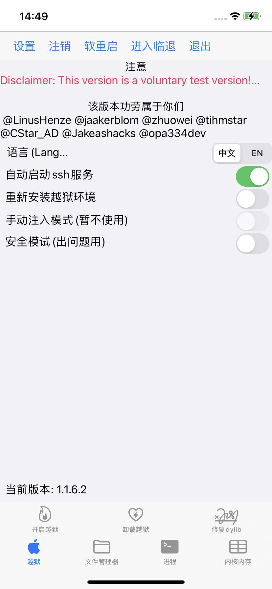
  * 设置
    * 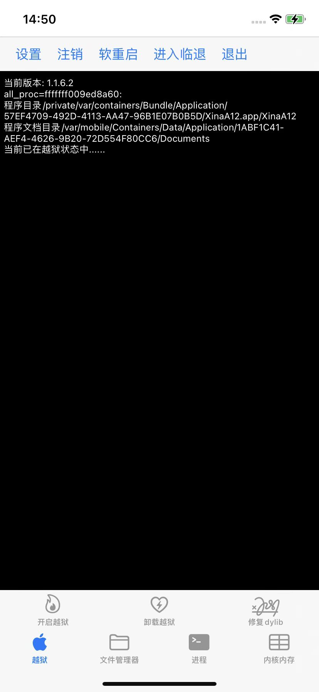
  * 文件管理器
    * 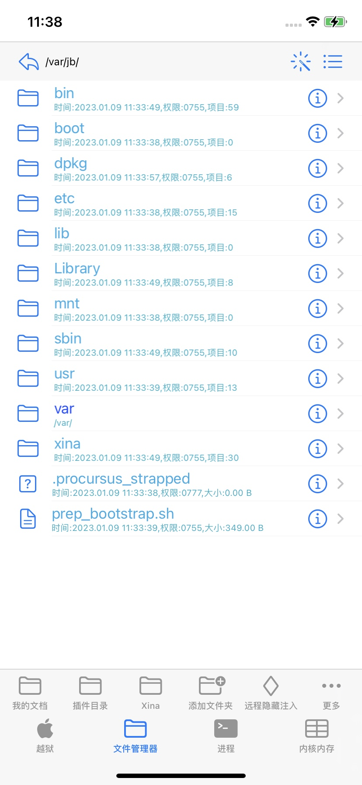
  * 进程
    * 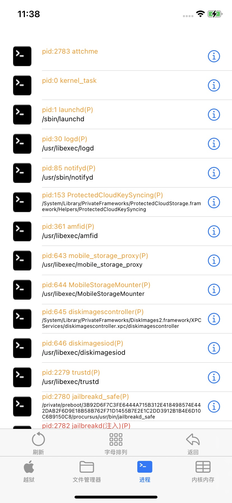
  * 内核内存
    * 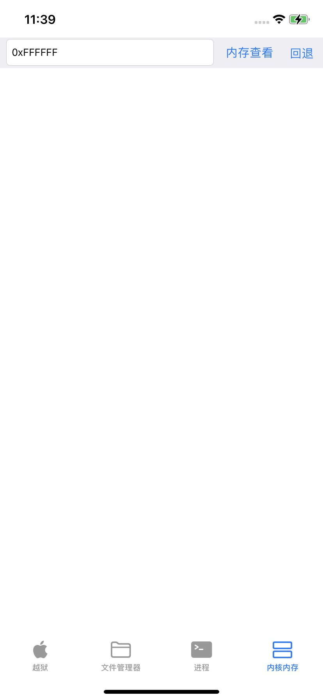
* 更早版本的界面
  * 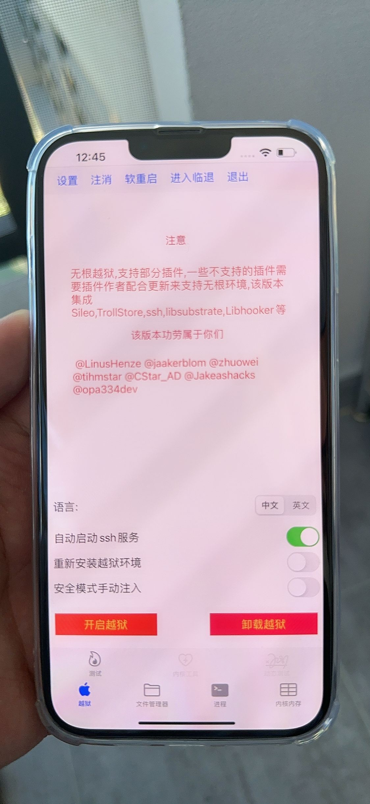

## XinaA15 1.1.8之后：新的UI界面

* 1.1.8
  * 主界面
    * 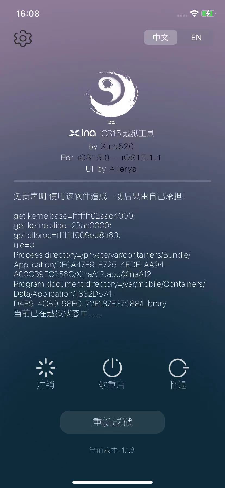
  * 设置
    * 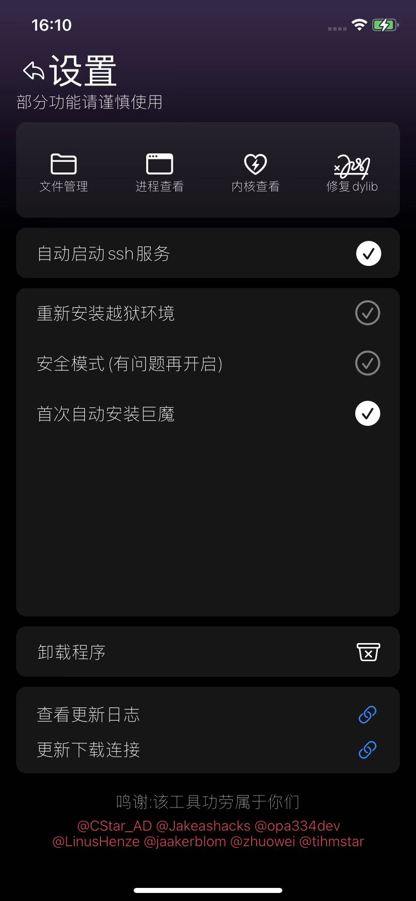
  * 其他功能模块
    * 文件管理器
      * 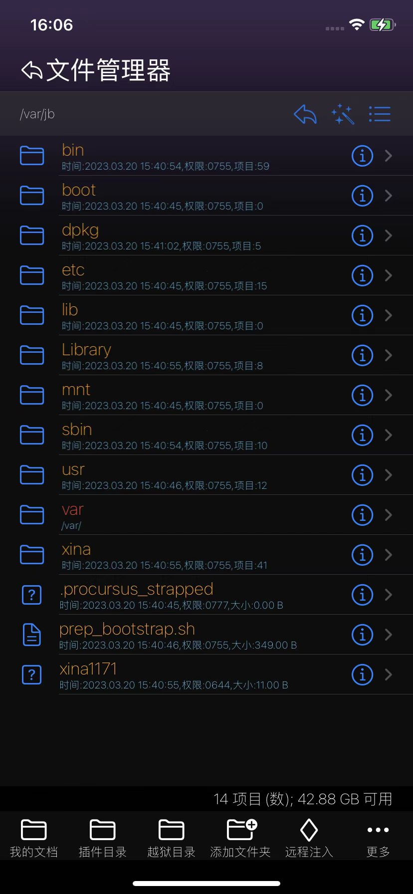
    * 进程管理器
      * 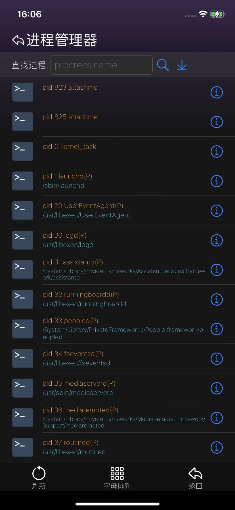
    * 内核查看器
      * 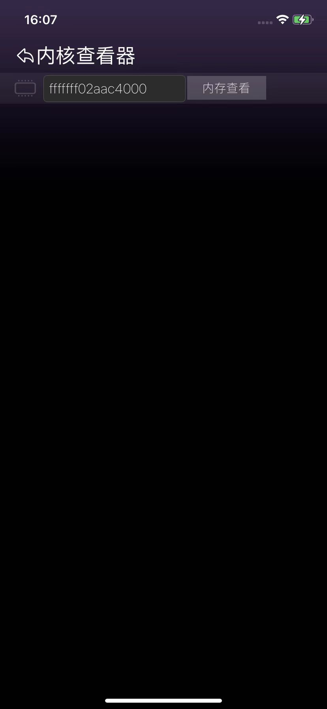
