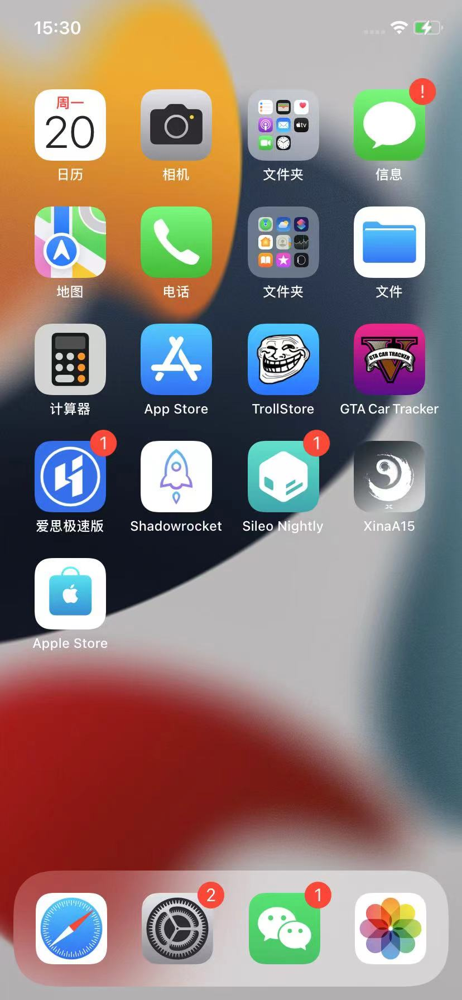
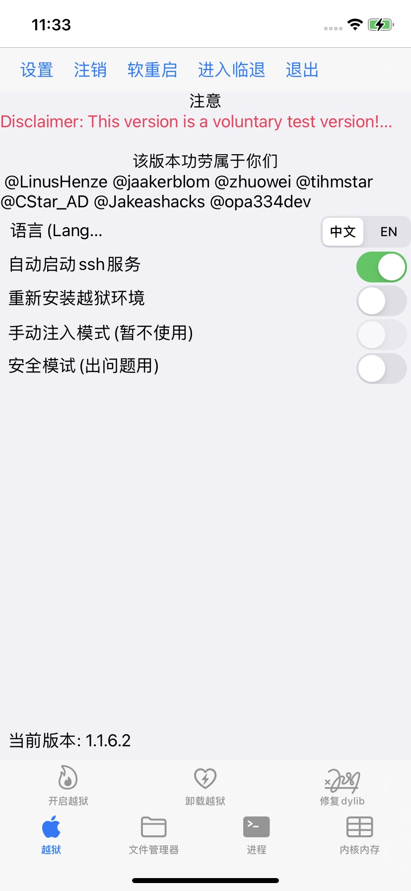
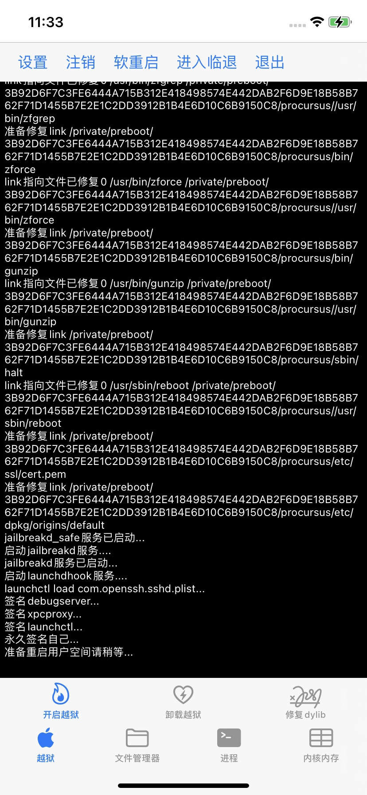
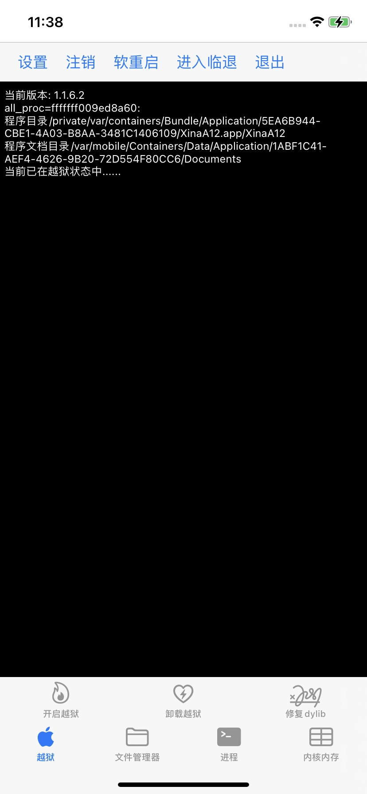

# 用XinaA15越狱=开启越狱

此处介绍用`XinaA15`给`iOS 15.1`的`iPhone11`越狱的过程：

* 点击iPhone桌面的XinaA15的app图标：
  * 
* 进入XinaA15的app的主页面，点击：`开启越狱`
  * 
* 接着会输出很多log日志
  * 
* 会重启桌面=respring
* 重启后，再次点击进入XinaA15的app，即可看到主页中提示：`当前已在越狱状态中`，表示：已越狱成功
  * 
